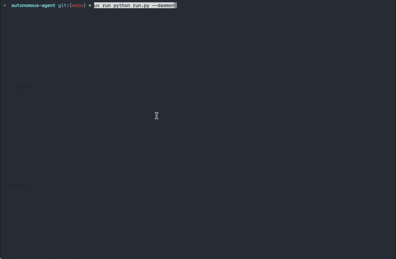
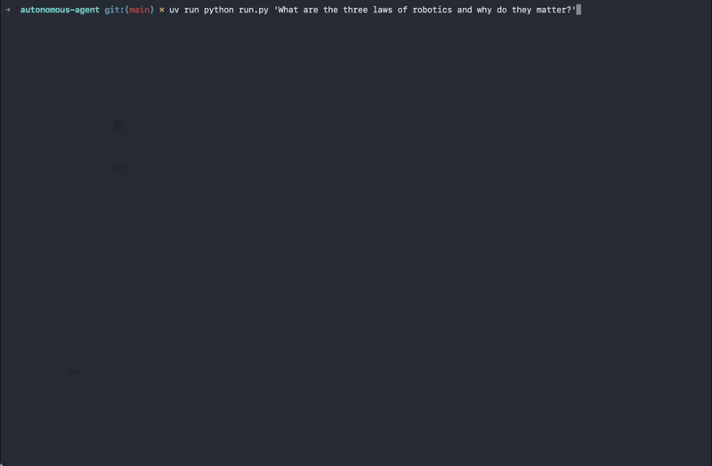

<h3 align="center">
  
  
  
</h3>

<h3 align="center">
  <b>klovis-agent</b><br>
  <sub>Composable autonomous agents that plan, act, and remember.</sub>
</h3>

<p align="center">
Composable Python library for building <b>goal-oriented autonomous agents</b>.<br>
Agents plan, execute, verify, and dynamically adapt their strategy through a LangGraph loop.<br>
In daemon mode, they observe their environment, decide whether to act, and consolidate their memory — all continuously.
</p>

<p align="center">
  
</p>

---

`klovis-agent` gives you everything you need to build agents that think, act, and learn:

🧠 **Goal-oriented execution** — the agent plans multi-step strategies, executes them, and replans on failure. Not a chatbot — a reasoning loop.

🔄 **Daemon mode (OODA)** — continuous perception-decision-action loop. The agent observes its environment, recalls relevant memories, and decides autonomously whether to act.

🧩 **Fully composable** — tools, perception sources, memory backends, and sandbox are all injectable. Nothing is hardcoded.

💾 **Two-zone persistent memory** — episodic (short-lived actions) and semantic (permanent knowledge) with vector search, auto-deduplication, and TTL pruning.

🎭 **Customizable personality (Soul)** — inject a personality via file or string. It shapes the agent's tone, values, and decision-making across all prompts.

🔒 **Safe by default** — destructive tools require explicit confirmation. Code runs in a sandbox (local or [OpenSandbox](https://opensandbox.dev)).

---

## Quick demo

```python
from klovis_agent import Agent, LLMConfig

agent = Agent(
    llm=LLMConfig(api_key="sk-...", default_model="gpt-4o"),
)
result = await agent.run("Explain quantum computing in simple terms")
print(result.summary)
```

That's it. The agent plans, executes, verifies, and returns a structured result.

<details>
<summary><b>Daemon mode (continuous OODA loop)</b></summary>

```python
from klovis_agent import Agent, LLMConfig, InboxPerceptionSource

agent = Agent(
    llm=LLMConfig(api_key="sk-..."),
    perceptions=[InboxPerceptionSource()],
)
daemon = agent.as_daemon(interval_minutes=5, max_cycles=100)
await daemon.run()
```
</details>

<details>
<summary><b>CLI usage</b></summary>

```bash
python run.py "Write a blog post about AI agents"
python run.py --daemon --interval 5 --cycles 100
python run.py --soul ./my-soul.md "Do something creative"
python run.py --ephemeral "Quick test"
```

| Option | Description | Default |
|--------|-------------|---------|
| `-v`, `--verbose` | Structlog + raw JSON logs | off |
| `--daemon` | Daemon mode (OODA loop) | off |
| `--interval MIN` | Interval between daemon cycles | 30 |
| `--cycles N` | Max daemon cycles (0 = infinite) | 0 |
| `--data-dir PATH` | Persistent data directory | `~/.local/share/klovis` |
| `--soul PATH` | Personality file (SOUL.md) | none |
| `--ephemeral` | Temporary workspace (nothing persists) | off |
</details>

<details>
<summary><b>Full composition example</b></summary>

```python
from klovis_agent import Agent, LLMConfig
from klovis_agent.tools.builtin import (
    WebSearchTool, MemoryTool, ShellCommandTool,
    SemanticMemoryTool, FileReadTool, FileWriteTool, FileEditTool,
    FsReadTool, FsWriteTool, FsMkdirTool,
)
from klovis_agent.perception.inbox import InboxPerceptionSource

agent = Agent(
    llm=LLMConfig(api_key="sk-...", default_model="gpt-4o"),
    tools=[WebSearchTool(), MemoryTool(), ShellCommandTool(workspace)],
    perceptions=[InboxPerceptionSource()],
    max_iterations=15,
)
```

Presets are also available:

```python
from klovis_agent.tools.presets import default_tools, minimal_tools

tools = default_tools(workspace, sandbox, embedder, skill_store)
tools = minimal_tools()
```
</details>

---

## How does it work?

### Execution loop (LangGraph)

Each run follows a 5-node graph:

```
                    ┌──────────┐
                    │   PLAN   │
                    │  (LLM)   │
                    └────┬─────┘
                         │
                         ▼
                    ┌──────────┐
              ┌────▶│ EXECUTE  │
              │     │  (tool)  │
              │     └────┬─────┘
              │          │
              │          ▼
              │     ┌──────────┐
              │     │  CHECK   │──────────┐
              │     │ (router) │          │
              │     └────┬─────┘          │
              │          │                │
              │     next step?       failed / replan?
              │          │                │
              │          ▼                ▼
              │          │          ┌──────────┐
              └──────────┘          │ REPLAN   │
                                    │  (LLM)   │
                                    └────┬─────┘
                                         │
                                         ▼
                                    ┌──────────┐
                                    │  FINISH  │
                                    │(summary) │
                                    └──────────┘
```

- **Plan** — the LLM breaks down the goal into steps and selects tools
- **Execute** — each step runs via the `ToolRegistry`
- **Check** — the router decides: continue, retry, replan, or finish
- **Replan** — on failure, the LLM generates a new plan with error context
- **Finish** — final summary + memory consolidation

### OODA loop (daemon mode)

```
    ┌─────────────────────────────────────────────────┐
    │                                                 │
    │  ┌──────────┐    ┌──────────┐    ┌──────────┐  │
    │  │ OBSERVE  │───▶│  ORIENT  │───▶│  DECIDE  │  │
    │  │ perceive │    │  recall  │    │  (LLM)   │  │
    │  └──────────┘    └──────────┘    └────┬─────┘  │
    │                                       │        │
    │                    should_act?         │        │
    │                  ┌────────┬────────────┘        │
    │                  │        │                     │
    │                  No      Yes                    │
    │                  │        │                     │
    │                  │   ┌────▼─────┐               │
    │                  │   │   ACT    │               │
    │                  │   │ agent.run│               │
    │                  │   └────┬─────┘               │
    │                  │        │                     │
    │                  │   ┌────▼──────────┐          │
    │                  │   │  CONSOLIDATE  │          │
    │                  │   │ extract memory│          │
    │                  │   └────┬──────────┘          │
    │                  │        │                     │
    │                  └────────┴─── sleep ───────────┘
    │                                                 │
    └─────────────────────────────────────────────────┘
```

| Phase | Module | Role |
|-------|--------|------|
| **Observe** | `perception.base.perceive()` | Polls all `PerceptionSource`s, aggregates `Event`s |
| **Orient** | `recall.recall_for_task()` | Searches episodic + semantic memory for relevant memories |
| **Decide** | `decision.decide()` | The LLM analyzes events + memories and decides whether to act |
| **Act** | `agent.run(goal)` | Runs the full LangGraph execution graph |
| **Consolidate** | `consolidation.consolidate_run()` | Extracts 2-6 memories from the run and stores them by zone |

---

## Memory system

The agent has a persistent two-zone memory, stored in SQLite with vector embeddings.

<p align="center">
  
</p>

| Zone | Content | TTL | Scoring | Deduplication |
|------|---------|:---:|---------|:---:|
| **episodic** | Actions taken, events, interactions | 14 days (auto-prune) | `similarity × 0.6 + recency × 0.4` | No (each action is unique) |
| **semantic** | Facts, lessons, preferences, identity | Permanent | Pure cosine similarity | Yes (similarity > 0.9 → update in-place) |

<details>
<summary><b>Memory lifecycle</b></summary>

```
Run completed
    │
    ▼
consolidate_run()          LLM extracts 2-6 memories with zone + tags
    │
    ├── zone: "episodic"   → INSERT (never deduplicated)
    │   tag: action_taken     "Replied to nex_v4 on post ee22ee81"
    │
    └── zone: "semantic"   → UPSERT if similarity > 0.9
        tag: lesson           "Moltbook API returns 500 sometimes, retry works"
    │
    ▼
Next daemon cycle
    │
    ▼
recall_for_task()          Prune episodic (TTL) then search both zones
    │
    ├── 4 episodic memories (sorted by score = sim + recency)
    └── 4 semantic memories (sorted by similarity)
    │
    ▼
Injected into decision and planning prompts
```

The schema is backward-compatible. Older SQLite databases without a `zone` column are automatically migrated on first access.
</details>

---

## Tools

32 built-in tools across 8 categories:

| Category | Tools |
|----------|-------|
| **Workspace** | `file_read`, `file_write`, `file_edit` |
| **Filesystem** | `fs_read`, `fs_list`, `fs_mkdir`, `fs_write`, `fs_delete`, `fs_move`, `fs_copy` |
| **Shell** | `shell_command` |
| **Memory** | `memory` (key-value), `semantic_memory` (vector, two zones) |
| **Web** | `web_search`, `http_request` |
| **Code** | `code_execution`, `text_analysis` |
| **GitHub** | `github_get_repo`, `github_read_file`, `github_list_files`, `github_create_branch`, `github_commit_files`, `github_create_pr`, `github_list_issues`, `github_list_prs`, `github_get_pr`, `github_search_code`, `github_clone_repo`, `github_create_issue`, `github_comment_issue`, `github_get_check_runs` |
| **Skills** | `list_skills`, `read_skill` |

Destructive tools (`fs_delete`, `fs_write`, `shell_command`...) require interactive confirmation. The flag is configurable per tool:

```python
shell = ShellCommandTool(workspace, requires_confirmation=False)
```

<details>
<summary><b>Creating a custom tool</b></summary>

```python
from klovis_agent import BaseTool, ToolSpec, ToolResult

class MyTool(BaseTool):
    requires_confirmation = False

    def spec(self) -> ToolSpec:
        return ToolSpec(
            name="my_tool",
            description="Does something useful",
            input_schema={
                "type": "object",
                "properties": {
                    "query": {"type": "string", "description": "The input"},
                },
                "required": ["query"],
            },
        )

    async def execute(self, inputs: dict) -> ToolResult:
        query = inputs["query"]
        return ToolResult(success=True, output={"result": f"Processed: {query}"})
```

Then inject it:

```python
agent = Agent(
    llm=LLMConfig(api_key="sk-..."),
    tools=[MyTool(), WebSearchTool()],
)
```
</details>

---

## Perception

The perception system is the agent's sensory interface. Any external source can feed events to the daemon.

| Source | Module | Events |
|--------|--------|--------|
| **Inbox** | `perception.inbox` | `.txt` files dropped in `~/.local/share/klovis/inbox/` |
| **Moltbook** | `tools.builtin.moltbook` | API notifications (mentions, replies, DMs) |
| **GitHub** | `tools.builtin.github` | Repo notifications, issues, PRs, pushes (optional — requires credentials) |
| **Discord** | `tools.builtin.discord_bot` | DMs and @mentions via Discord bot (optional — requires bot token) |

Available event types: `NOTIFICATION`, `MESSAGE`, `MENTION`, `REACTION`, `NEW_CONTENT`, `REQUEST`, `SCHEDULE`, `SYSTEM`, `OTHER`.

<details>
<summary><b>Creating a custom perception source</b></summary>

```python
from klovis_agent import PerceptionSource
from klovis_agent.perception.base import Event, EventKind

class RSSPerceptionSource(PerceptionSource):
    @property
    def name(self) -> str:
        return "rss"

    async def poll(self) -> list[Event]:
        return [
            Event(
                source="rss",
                kind=EventKind.NEW_CONTENT,
                title="New article: ...",
                detail="...",
                metadata={"url": "https://..."},
            )
        ]
```
</details>

---

## Soul (personality)

The **soul** defines the agent's personality: tone, style, values, identity. It is injected into all system prompts (plan, execute, replan, finish, decision).

```python
from pathlib import Path
from klovis_agent import Agent, LLMConfig

# From a file
agent = Agent(llm=LLMConfig(api_key="sk-..."), soul=Path("./my-soul.md"))

# As raw text
agent = Agent(llm=LLMConfig(api_key="sk-..."), soul="You are a pirate. Arrr.")

# No soul (neutral agent)
agent = Agent(llm=LLMConfig(api_key="sk-..."))
```

<details>
<summary><b>Recommended SOUL.md structure</b></summary>

| Section | Purpose |
|---------|---------|
| **Identity** | Who the agent is, its name, its nature |
| **Personality** | Character traits (curious, honest, playful...) |
| **Voice** | Writing style (tone, register, length) |
| **Values** | Guiding principles (quality, authenticity...) |
| **What you are NOT** | Explicit boundaries (not an assistant, not a content mill...) |
</details>

---

## Configuration

Environment variables (prefix `AGENT_`, delimiter `__` for nested objects):

```bash
export AGENT_LLM__API_KEY="sk-..."              # Required
export AGENT_LLM__DEFAULT_MODEL="gpt-4o"        # Default model
export AGENT_LLM__BASE_URL="https://api.openai.com/v1"
export AGENT_LLM__MAX_TOKENS=4096
export AGENT_LLM__TEMPERATURE=0.2
export AGENT_MAX_ITERATIONS=25
export AGENT_SANDBOX__BACKEND="local"            # "local" or "opensandbox"
export AGENT_DATA_DIR="~/.local/share/klovis"
```

Or via a `.env` file at the project root (automatically loaded by `run.py`).

<details>
<summary><b>GitHub integration (optional)</b></summary>

The agent can read code, create branches, commit files, and open pull requests on GitHub. Authentication supports either a **GitHub App** (recommended) or a **Personal Access Token**.

**GitHub App:**

```bash
export GITHUB_APP_ID="123456"
export GITHUB_APP_PRIVATE_KEY_PATH="~/.local/share/klovis/github-app-key.pem"
export GITHUB_APP_INSTALLATION_ID="789012"
```

**Personal Access Token:**

```bash
export GITHUB_TOKEN="github_pat_..."
```

**Daemon perception** — configure which repos to watch in `run.py`:

```python
_GITHUB_REPOS = [
    {"owner": "your-username", "repo": "your-repo", "issue_labels": ["agent"]},
    {"owner": "your-username", "repo": "other-project"},
]
```

Each entry creates a `GitHubPerceptionSource` instance. The agent observes all of them during its OODA loop. If no GitHub credentials are set, the tools are simply not registered — no error, no dependency.

Install the optional crypto dependency for GitHub App auth:

```bash
pip install "klovis-agent[github]"
```
</details>

<details>
<summary><b>Discord integration (optional)</b></summary>

Chat with your agent in real time through Discord DMs or @mentions — just like messaging a person on WhatsApp.

**1. Create a Discord bot:**

1. Go to https://discord.com/developers/applications → **New Application**
2. **Bot** tab → **Reset Token** → copy the token
3. Enable **Message Content Intent** (Bot → Privileged Gateway Intents)
4. **OAuth2** → **URL Generator** → check `bot` scope + `Send Messages`, `Read Message History` permissions
5. Use the generated link to invite the bot to your server

**2. Configure environment:**

```bash
export DISCORD_BOT_TOKEN="your-bot-token"
export DISCORD_ALLOWED_USERS="123456789,987654321"   # optional — restrict to specific user IDs
```

Leave `DISCORD_ALLOWED_USERS` empty to allow anyone to interact with the bot (not recommended on public servers).

**3. Run in daemon mode:**

```bash
python run.py --daemon --interval 0.5
```

The bot connects automatically when a `DISCORD_BOT_TOKEN` is detected. You can DM the bot directly or @mention it in any channel it has access to. The agent processes each message as a goal, executes it, and replies with the result.

</details>

<details>
<summary><b>REST API</b></summary>

```bash
uvicorn klovis_agent.api:app --reload
```

| Method | Route | Description |
|--------|-------|-------------|
| `POST` | `/runs` | Create and execute an agent run |
| `GET` | `/runs` | List runs |
| `GET` | `/runs/{id}` | Run details |
| `GET` | `/runs/{id}/logs` | Run logs |
| `GET` | `/health` | Health check |
</details>

---

## Architecture

<details>
<summary><b>Project structure</b></summary>

```
klovis_agent/
├── __init__.py              # Public API (lazy imports)
├── agent.py                 # Agent class (main facade)
├── config.py                # LLMConfig, SandboxConfig, AgentConfig
├── result.py                # AgentResult (user-friendly wrapper)
├── daemon.py                # AgentDaemon (OODA loop)
├── decision.py              # LLM decision module
├── recall.py                # Pre-run memory recall (two zones)
├── consolidation.py         # Post-run memory consolidation (zone tagging)
├── api.py                   # FastAPI REST API
│
├── core/                    # LangGraph internals
│   ├── graph.py             # Graph construction
│   ├── nodes.py             # Nodes: plan, execute, check, replan, finish
│   ├── prompts.py           # System prompts
│   └── schemas.py           # Structured output schemas
│
├── llm/                     # LLM layer
│   ├── gateway.py           # ModelGateway Protocol + OpenAIGateway
│   ├── router.py            # Phase-based routing (plan/execute/check/finish)
│   ├── embeddings.py        # Embeddings client
│   └── types.py             # ModelRequest, ModelResponse, ModelRoutingPolicy
│
├── tools/                   # Composable tool system
│   ├── base.py              # BaseTool, ToolSpec, ToolResult, ask_confirmation
│   ├── registry.py          # ToolRegistry (dispatch + confirmation)
│   ├── workspace.py         # AgentWorkspace (isolated directories)
│   ├── presets.py           # default_tools(), minimal_tools()
│   └── builtin/             # Built-in tools
│       ├── file_tools.py    # file_read, file_write, file_edit
│       ├── filesystem.py    # fs_read, fs_list, fs_mkdir, fs_write, ...
│       ├── shell.py         # shell_command
│       ├── memory.py        # memory (key-value)
│       ├── semantic_memory.py # semantic_memory (vector, two zones)
│       ├── web.py           # web_search, http_request
│       ├── code_execution.py # code_execution, text_analysis
│       ├── moltbook.py      # Moltbook tools + perception
│       ├── github.py        # GitHub tools + perception (optional)
│       ├── discord_bot.py   # Discord bot perception (optional)
│       └── skills.py        # list_skills, read_skill
│
├── perception/              # Perception sources
│   ├── base.py              # PerceptionSource ABC, Event, EventKind, perceive()
│   └── inbox.py             # InboxPerceptionSource (.txt files)
│
├── memory/                  # Memory backends (re-exports)
│   ├── kv.py                # KeyValueMemory
│   └── semantic.py          # SemanticMemoryStore (re-export)
│
├── models/                  # Pydantic models (Task, StepSpec, AgentState, etc.)
├── sandbox/                 # Isolated code execution (Local / OpenSandbox)
└── infra/                   # SQLite persistence
```
</details>

---

## Design principles

- **Composable** — tools, perceptions, memory, and sandbox are all injectable. Nothing is hardcoded.
- **LLM ≠ Agent** — the LLM is a reasoning engine. The runtime (LangGraph) controls the loop, retries, and limits.
- **Structured outputs** — no free-text parsing. The LLM produces JSON validated against schemas.
- **Two-zone memory** — ephemeral actions (episodic) and permanent knowledge (semantic) live in separate spaces with different scoring and retention strategies.
- **Explicit confirmation** — destructive operations require human validation. Configurable per tool.
- **Dynamic planning** — automatic replanning on failure, with error context injection.
- **Sandbox** — generated code runs in isolation (local or OpenSandbox).
- **Source-agnostic perception** — the daemon doesn't know where events come from. Any source implementing `PerceptionSource` can feed the loop.
