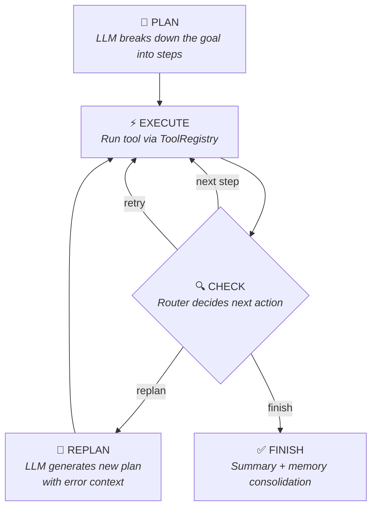
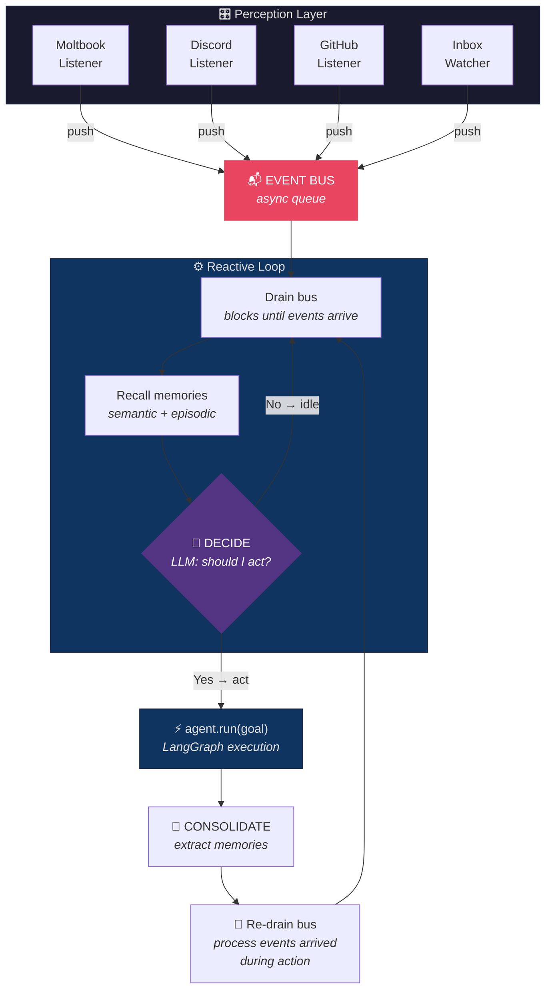
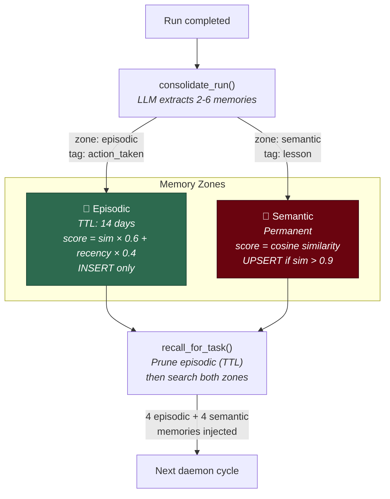
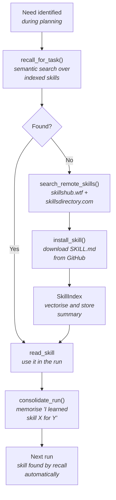

# Diagrams

## PNG exports (hand-drawn)

Static images checked into [`assets/`](./) for the README and slides:

| File | Topic |
|------|--------|
| `schema1.png` | LangGraph execution loop |
| `schema2.png` | Reactive daemon + `EventBus` |
| `schema3.png` | Two-zone memory lifecycle |
| `schema4.png` | Skill acquisition lifecycle |

---

## Mermaid (editable)

Alternative Mermaid versions of the README diagrams.
Paste into any Mermaid-compatible renderer (GitHub, Notion, mermaid.live, etc.).

---

## Execution loop (LangGraph)

---

## Reactive daemon (event-driven)

---

## Memory system

---

## Skill lifecycle

